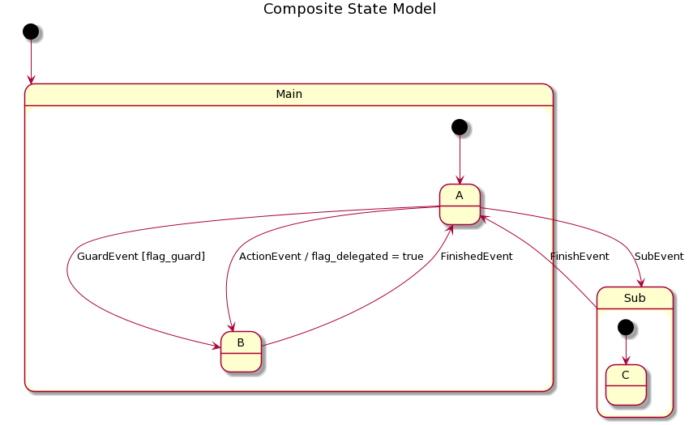

# Build & Run unit tests

Ensure you have gcc or any c++ compiler added into your system path. Then, run the following commands:

```
mkdir build
cd build
cmake .. -G "MinGW Makefiles" -DENABLE_COVERAGE=ON
make -j8 && make test
ctest
gcovr -r ../ . --exclude ".*test/.*" --html --html-details -o cov.html
```

# State Machine Design

The new state machine needs to fix a couple of issues that we are already facing:

- Having one state machine with all the states definition and transition is too hard to maintain as the number of state keeps increasing. When changing it the risk of regression is high. To solve that we need to have a state machine able to handle hierarchy. This way any state machine can be broken down into independent sub state machine.

  


- The possibility to create the state machine at runtime and to have possibly multi instances of them. For instance, if we had a state machine in the motor class then we need to be able to have 12 different instances of that same state machine.

- The need to have a readable state machine "all-in-one-spot" definition

  ### Design Description

  The state machine design is only one header file, so far. It does contain 2 classes:

  ```c++
  class State_
  {
  public:
      State_(std::string name);
      virtual ~State_();
  
      void addTransition(Transition t);
      
      void setRun(std::function<void()> f);
      void setOnEntry(std::function<void()> f);
      void setOnExit(std::function<void()> f);
      
      virtual std::shared_ptr<State_> handleEvent(EventId const& e);
      
      std::function<void()> Run_     = NoAction;
      std::function<void()> OnEntry_ = NoAction;
      std::function<void()> OnExit_  = NoAction;
  
  private:
      std::vector<Transition> transitionTable_ {};
      std::string name_;
  };
  ```

  `State_` is the default mother class definition of all states.

  It does contain a vector of `Transition`which represents all the possible transitions it can switch to from this state.

  A transition happens on an event, can trigger an action, can be conditional (guards) and knows the state it needs to switch to. This is the definition of the struct:

  ```c++
  struct Transition
  {
      EventId eventId;
      std::shared_ptr<State_> stateTo;
      std::function<bool_t()> guard;
      std::function<void()> action;
  };
  ```

  An event is just represented by an int id and a text string which is only needed for log purpose.

  ```c++
  struct EventId
  {
      int id;
      std::string name;
  };
  ```

  The second class is `StateManagerClass_`which actually handles the state transitions and which knows the current state we're in. It is a `State_`as well which enables state machines encapsulation.

  ```c++
  class StateManagerClass_ : public State_
  {
  public:
      StateManagerClass_(std::string name);
      virtual ~StateManagerClass_();
  
      virtual std::shared_ptr<State_> handleEvent(EventId const& e) override;
      
      void start();
      void run();
      void reset();
      void setInitState(State state);
      bool isState(std::string const& str);
  
  private:
      State initState_ {nullptr};
      State currentState_ {nullptr};
  
  };
  ```

  Know that the owner will need to manipulate shared pointers, thus to help the writing of the code these 2 helpers have been exposed:

  ```c++
  using State = std::shared_ptr<State_>;
  using StateManager = std::shared_ptr<StateManagerClass_>;
  ```

  ### Simple example

  This example is the exact same one used in the State Machine unit test:

  

  

  As code, once events and states have been declared, this state machine is defined as followed:

  ```c++
      State stateA = std::make_shared<StateA>();
      State stateB = std::make_shared<StateB>();
      StateManager mainState = std::make_shared<StateManagerClass_>("Main");
      SET_INIT_STATE(mainState, stateA);
  
      State stateC = std::make_shared<StateC>();
      StateManager subState = std::make_shared<StateManagerClass_>("Sub");
      SET_INIT_STATE(subState, stateC);
  
      // MainState transitions
      ADD_TRANSITION (stateA,    StartEvent,  stateB);
      ADD_TRANSITION (stateA,    SubEvent,    subState);
      ADD_TRANSITION_GUARD (stateA,
                              GuardEvent,
                              [] {return flag_guard;},
                              stateB);
  
      ADD_TRANSITION_GUARD_ACTION (stateA,
                                   ActionEvent,
                                   [] {return true;},
                                   [] {flag_delegated = true;},
                                   stateB);
  
      ADD_TRANSITION (stateB,    FinishEvent, stateA);
  
      // Substate transitions
      ADD_TRANSITION (subState,  FinishEvent, stateA);
  
      mainState->start();
  ```

  This is still an early design and will likely continue to evolve, however it enables already the main needed  features  (state machines encapsulation and creation at runtime).
  
  The state machine is typically called from a periodic routine by the following code example: 

  ```c++
  	...
    mainState_->run();
    if ( nextEvent_ != noEvent )
    {
        mainState_->handleEvent(nextEvent_);
        nextEvent_ = noEvent;
    }
    ...
  ```

